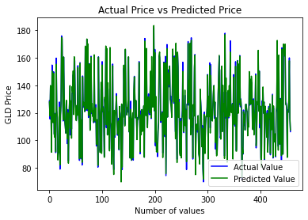

<!-- Output copied to clipboard! -->

<!-----

You have some errors, warnings, or alerts. If you are using reckless mode, turn it off to see inline alerts.
* ERRORs: 0
* WARNINGs: 0
* ALERTS: 1

Conversion time: 0.932 seconds.

Using this Markdown file:

1. Paste this output into your source file.
2. See the notes and action items below regarding this conversion run.
3. Check the rendered output (headings, lists, code blocks, tables) for proper
   formatting and use a linkchecker before you publish this page.

Conversion notes:

* Docs to Markdown version 1.0β33
* Mon Aug 22 2022 04:47:45 GMT-0700 (PDT)
* Source doc: GOLD PRICE PREDICTION
* Tables are currently converted to HTML tables.
* This document has images: check for >>>>>  gd2md-html alert:  inline image link in generated source and store images to your server. NOTE: Images in exported zip file from Google Docs may not appear in  the same order as they do in your doc. Please check the images!

----->

>>>>>  gd2md-html alert:  ERRORs: 0; WARNINGs: 0; ALERTS: 1.

<ul style="color: red; font-weight: bold"><li>See top comment block for details on ERRORs and WARNINGs. <li>In the converted Markdown or HTML, search for inline alerts that start with >>>>>  gd2md-html alert:  for specific instances that need correction.</ul>

Links to alert messages:
<a href="#gdcalert1">alert1</a>

>>>>> PLEASE check and correct alert issues and delete this message and the inline alerts.

** **

**GOLD PRICE PREDICTOR**

**CSE422- Artificial Intelligence**

**Section - 7**

**Submitted By:**

* **MD Rafid Reaz**
    * ID-19201044
* **Ibtesum Arif**
    * ID-19201054
* **Mahpara Chowdhury**
    * ID-20101607
* **Taskiea Tabassum Ananya**
    * ID- 19301192

**Introduction:**

Gold is one of the precious metals. It is used as a medium for money or exchange because of its limited supply and high value. This metal’s scarcity and difficulty in extraction made it a valuable commodity. It plays a distinctive role not only as financial assets in international currency reserves but also contributing significantly to the stabilization of the international money market. Due to its increasing value, many people considered gold as an attractive investment.

Investments and savings are an important element of everyone's life. Investments are meant to earn favorable returns in the future by employing our present funds in some trustworthy assets. In economic terms, it is considered to be the purchasing of assets which are kept low in the present and to be used in the future for creating our wealth. These investments can be sold for a higher price which in turn increases the profit. Gold is considered as an attractive investment due to its area of usage and increase in value. The price of gold depends on various factors such as currency value, political issues, transportation cost etc. This increase in value of gold and down of price in other markets led more investors to be attracted towards gold. But at some point when the gold price went down, investing in gold became riskier. Hence, prediction of gold price is a vital issue in financial economics.So, this particular study is concentrating on the gold price with respect to other factors in the economy. To analyze the data, three machine learning algorithms are employed- Decision Tree Regressor, XGB Regressor, and Random Forest Regressor. We can find accurate data by comparing these three algorithms under various circumstances.

**Methodology:**

The study is carried out using Machine Learning. In order to acquire the best possible result, both data training and testing were undertaken. The Decision Tree Regressor, XGB Regressor, and Random Forest Regressor were among the machine learning methods employed to analyze the data in this study. Regression analysis is a statistical tool for determining the relationship between two or more variables. When one of the independent variables changes while the other variables remain constant, regression analysis is performed to see how the value of the dependent variable changes. Decision Tree Regression follows a predictive model. It uses a set of binary rules and then calculates target value. Every individual tree has its own branches, nodes and leaves. A decision tree is a type of tree that can be used to forecast and classify data. A Random Forest uses several decision trees with a technique called Bootstrap Aggregation to solve both regression and classification problems. The random forest algorithm can be used for feature engineering, which is the process of determining the most essential attributes from a set of options. Gradient boosting is a technique for selecting the best forecast from a large group. It also generalizes them by allowing the optimization of an object. Python is used to implement these machine learning methods (Decision Tree Regression, Random Forest Regression, and XGB Regressor) in this study. 

**Dataset description:** 

A dataset, as the name suggests, is a collection of data. In Machine Learning projects, we always need a dataset. Firstly, we need the training dataset to train our model, to help it predict. Then, we use testing datasets to predict and check how accurate our model is.

This dataset is about gold price prediction. There are 6 columns in this dataset. First we need to import library functions to read the dataset and perform EDA. 

There are 5 columns which are floating or numerical and the other one is an object.

**Features: **

* Date - mm/dd/yyyy
* SPX - is a free-float weighted measurement stock market index of the 500 largest companies listed on stock exchanges in the United States.
* USO - United States Oil Fund - Not Sure of UOM
* SLV - Silver Price
* EUR/USD - currency pair quotation of the Euro against the US

This is the label that we are going to use

**Label:**

* GLD - Gold Price

**Data Preprocessing:**

Data preprocessing is a process of preparing the raw data and making it suitable for a machine learning model. A real-world data generally contains noises, missing values, and maybe in an unusable format which cannot be directly used for machine learning models. Data preprocessing is required for cleaning the data and making it suitable for a machine learning model which also increases the accuracy and efficiency of a machine learning model.

In machine learning data preprocessing, we divide our dataset into a training set and test set. This is one of the crucial steps of data preprocessing as by doing this, we can enhance the performance of our machine learning model.

In order to perform data preprocessing using Python, we need to import some predefined Python libraries such as numpy,matlab,pandas. Then we need to import the datasets which we have collected for our machine learning project.

Now for preprocessing we followed these steps and got this takeaways.

1. **Finding Unwanted Columns**   

    Take-away: We won't consider the Date feature so we will drop this feature in the feature engineering section.   

2.  **Finding Missing Values**

    Take-away: No missing value found.

3. **Find Features with One Value**

    Take-away: No feature with only one value.

4. **Explore the Categorical Features**

    Take-away: There are one categorical features.

5.  **Find Categorical Feature Distribution**

    Take-away: N/A

6. **Relationship between Categorical Features and Label**

    Take-away: N/A

7. **Explore the Numerical Features**

    Take-away: There are 4 numerical features.

8. **Find Discrete Numerical Features**

    Take-away:There is no Discrete Variables in give dataset

9. **Relation between Discrete numerical Features and Labels**

    NA

10. **Find Continuous Numerical Features**

    Take-away: There are 4 continuous numerical features

11. **Distribution of Continuous Numerical Features**

    Take-away: It seems SPX,SLV and EUR/USD distributed normally,USO heavily skewed towards right and seems to have some outliers.

12. **Relation between Continuous numerical Features and Labels**

    Take-away: It seems SLV feature linearly progressing with GLD

13. **Find Outliers in numerical features**

    Take-away: It seems USO and SLV has some outliers

14. **Explore the Correlation between numerical features**

    Take-away: It seems SLV feature is heavily correlated with GLD

**MODEL SELECTION:**

We have applied 3 model which are given below

* **DecisionTreeRegressor**: Decision Tree is a decision-making tool that uses a flowchart-like tree structure or is a model of decisions and all of their possible results, including outcomes, input costs, and utility. Decision-tree algorithms fall under the category of supervised learning algorithms. It works for both continuous as well as categorical output variables.
* **RandomForestRegressor **: Random Forest Regression is a supervised learning algorithm that uses ensemble learning methods for regression. It operates by constructing several decision trees during training time and outputting the mean of the classes as the prediction of all the trees.
* **XGBRegressor: **GBoost stands for "Extreme Gradient Boosting" and it is an implementation of gradient boosting trees algorithm. The XGBoost is a popular supervised machine learning model with characteristics like computation speed, parallelization, and performance.

>>>>>  gd2md-html alert: inline image link here (to images/image1.png). Store image on your image server and adjust path/filename/extension if necessary.  (<a href="#">Back to top</a>)(<a href="#gdcalert2">Next alert</a>) >>>>> 

From this graph we can see the ratio of actual value and Predicted value.Which helps us to predict the price.

**RESULT**

<table>
  <tr>
   <td>
   </td>
   <td><strong>model</strong>
   </td>
   <td><strong>best_score</strong>
   </td>
  </tr>
  <tr>
   <td>0
   </td>
   <td>decision_tree
   </td>
   <td>0.981895
   </td>
  </tr>
  <tr>
   <td>1
   </td>
   <td>RandomForestRegressor
   </td>
   <td>0.909837
   </td>
  </tr>
  <tr>
   <td>2
   </td>
   <td>XGBRegressor
   </td>
   <td>0.984461
   </td>
  </tr>
</table>

After applying model selection techniques on algorithms like DecisionTreeRegressor, RandomForestRegressor and XGBRegressor. We found that XGBRegressor gives the best result. and hence we will build a model using the XGBRegressor algorithm.

**References**

1)Data set- [https://www.kaggle.com/datasets/altruistdelhite04/gold-price-data](https://www.kaggle.com/datasets/altruistdelhite04/gold-price-data)

2)Aye G, Gupta R et al (2015) Forecasting the price of gold using dynamic model averaging. Int Rev Financ Anal 41:257–266

3)Liu, D., Li, Z. (2017). Gold Price Forecasting and Related Influence Factors Analysis Based on Random Forest . In: Xu, J., Hajiyev, A., Nickel, S., Gen, M. (eds) Proceedings of the Tenth International Conference on Management Science and Engineering Management. Advances in Intelligent Systems and Computing, vol 502. Springer, Singapore. https://doi.org/10.1007/978-981-10-1837-4_59
